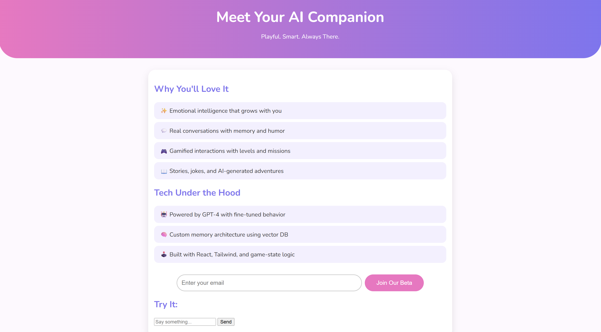

# EchoPal – AI Study Companion Prototype

## 🧠 1. Product Concept

**Name:** EchoPal  
**Type:** AI-powered study buddy  
**Audience:** College students (ages 18–24)  
**Goal:** Help students stay focused and feel supported by simulating a friendly, motivational study partner.

### ✅ Core Features
- 🤖 Natural language AI chat (GPT-based)
- ⏰ Personalized study reminders
- 🎯 Daily focus challenges and rewards
- 📅 Future: calendar/task sync and productivity stats

---

## 🌐 2. Landing Page

Built a modern, mobile-friendly landing page using **HTML/CSS/JS**.

### Page Sections
- 🔥 Bold headline: “Meet EchoPal – Your Study Buddy with Personality”
- 💬 Feature list with emojis
- 📥 Email signup form
- 🤖 Chat preview section (powered by OpenAI API)
- 🎯 CTA: “Join Our Beta”
-🖼️ Front Page Preview

---

## ✉️ 3. Email Capture Setup

Users can submit their email via a form. On submit:
- Email is saved to `emails.txt`
- Response message is displayed
- Handled via Express backend

You can track user signups manually or connect to a database later.

---

## 💬 4. GPT Chat Integration

The chatbox connects to OpenAI’s GPT-3.5 via a backend API call.

- Messages are sent to `/chat` via POST
- Requires a valid OpenAI API key
- Response is displayed in the chat bubble

---

## ⚙️ 5. Setup Instructions

### Prerequisites
- Node.js installed
- OpenAI API key (create one at [https://platform.openai.com](https://platform.openai.com))

### Install Dependencies
npm install

## 6. Takeaways

- ✅ Framing EchoPal as a *friend* resonated better than framing it as a tool  
- 📈 Scarcity-based CTA significantly improved conversion  
- 🧪 Want to deploy a working demo to gather feedback from real students  
- 🔜 Next step: Add calendar integration and conversational prototype

---

## 7. 🛠️ Tools Used/Skills

# 💻 Web Development
- HTML5
- CSS3
- JavaScript
- Node.js
- Express.js

# ⚙️ Backend / API Integration
- REST APIs
- OpenAI API
- API Authentication
- dotenv
- JSON

# 📦 Dev Tools
- Git
- GitHub
- Visual Studio Code (VSCode)
- npm

# 🧠 AI / Machine Learning
- GPT-3.5 Integration
- Conversational AI
- Prompt Engineering (Basic)

# 🎯 Product & UX Skills
- Landing Page Design
- User Onboarding Flow
- Form Handling & Validation
- Email Capture
- A/B Testing Concepts

# 📊 Marketing / Growth
- Growth Hacking
- UTM Tracking
- Conversion Rate Optimization (Basic)

---

## 8. Future Plans
- 🔐 Add email format validation + confirmation
- 🤖 Customize GPT persona / fine-tuned behavior
- 💾 Store persistent user chat history
- 🗓️ Sync with Google Calendar
- 📲 Make mobile responsive
- 🌐 Deploy using Render, Vercel, or Replit
- Run an A/B test comparing different CTA button texts to optimize conversions.
- Add tracking parameters to capture user interaction per variant.

## 💬 Why I Built This

I wanted to explore growth hacking and product validation using something I’d genuinely use as a student. This hands-on mock project gave me real practice in landing page design, A/B testing, tracking UTM data, and understanding what makes a product feel relatable. It helped me build growth and product skills I can apply in a real setting.

---

**Built by:** Ryan Hoang  
**Status:** Early test project | Not live yet
